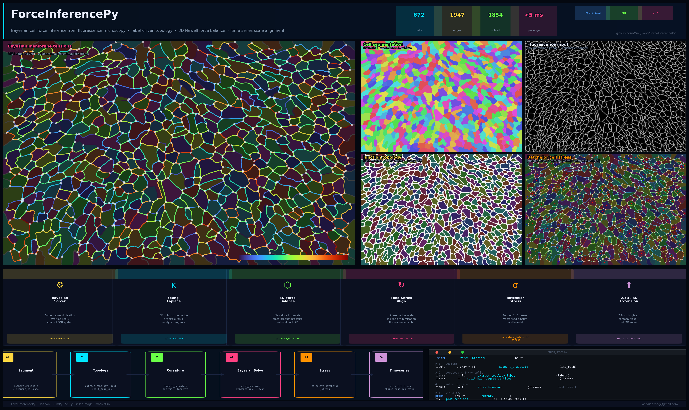

# ForceInferencePy

[](https://github.com/Weiykong/ForceInferencePy/actions/workflows/tests.yml)
[](https://www.python.org/downloads/)
[](LICENSE)
[](https://napari.org)

> **Bayesian cell force inference from fluorescence microscopy.**
> Label-driven topology · Bayesian / Young-Laplace / 3D solvers · Time-series scale alignment · Napari GUI



---

## What it does

ForceInferencePy turns a membrane fluorescence image into a mechanical map of the tissue:

| Step | Output |
|------|--------|
| Segment cells | integer label mask |
| Extract junction graph | `Tissue` — vertices, edges, cell polygons |
| Solve force balance | `ForceResult` — tensions **T**, pressures **P**, residual |
| Compute Batchelor stress | per-cell 2×2 stress tensor **σ** |
| Fit interface curvature | κ + analytic tangents for Laplace solve |
| Align time-series | scale-normalised tension trajectories across frames |

All results come back as plain numpy arrays; matplotlib and napari helpers are included for visualisation.

---

## Installation

```bash
# core (numpy · scipy · scikit-image · matplotlib)
pip install -e .

# + Cellpose segmentation
pip install -e ".[cellpose]"

# + Napari GUI  (all 43 parameters in a dock widget)
pip install -e ".[napari]"

# everything
pip install -e ".[cellpose,napari]"
```

---

## Five-line quick start

```python
import force_inference as fi

labels, gray  = fi.segment_grayscale("data/test.tif")
tissue        = fi.extract_topology_label(labels)
result        = fi.solve_bayesian(tissue).best_result    # or pass mu= directly
print(result.summary())
fi.plot_tensions(ax, tissue, result)
```

---

## Full pipeline

### 1 · Segmentation

```python
from force_inference.segmentation import segment_cellpose, segment_grayscale

# Recommended — Cellpose 3 / 4
labels, gray = segment_cellpose(
    "image.tif",
    model_type         = "cyto3",   # "cpsam" for CP4, "cyto2" for legacy
    diameter           = None,      # px — None = auto
    flow_threshold     = 0.4,
    cellprob_threshold = 0.0,       # lower → more cells from faint membranes
    min_size           = 15,
    gpu                = True,
    invert             = False,
)

# Fallback — watershed (no GPU required)
labels, gray = segment_grayscale(
    "image.tif",
    h_depth       = 2.0,
    blur_sigma    = 1.0,
    min_cell_size = 20,
)
```

### 2 · Topology extraction

```python
from force_inference.topology_label  import extract_topology_label
from force_inference.split_four_way  import split_high_degree_vertices

tissue = extract_topology_label(
    labels,
    min_edge_len          = 2,
    trace_pixels          = True,
    use_skeleton_geometry = True,
    clean                 = False,      # remove stray boundary pixels
    min_clean_edge_len    = 3.0,
    remove_outer_layer    = False,
    vertex_cluster_r      = 2.0,        # junction merging radius (px)
    curve_points          = 0,
    collapse_stubs        = True,
    stub_edge_threshold   = 3.0,
    collapse_tiny_twins   = False,
    tiny_twin_threshold   = 3.0,
    junction_window       = 0,
    dilate_labels         = 0,
)

# Replace 4-way junctions with pairs of 3-way junctions
tissue = split_high_degree_vertices(tissue, split_length=4.0)
```

**Why label-driven?**  Skeletonisation merges junctions that are only a few pixels apart, erasing short real interfaces.  `extract_topology_label` reads cell-label neighbourhoods directly, so every resolved interface is kept.

### 3 · Solvers

```python
from force_inference.solvers import solve_bayesian, solve_bayesian_3d, solve_laplace

# ── Bayesian 2D (default) ─────────────────────────────────────────────────
#   mu = None  →  evidence maximisation scans [10⁻¹⁰ … 10⁻⁵]
#   mu = float →  single-shot solve at that regularisation
scan   = solve_bayesian(tissue, mu=None,
                         exclude_border_edges=True, border_margin=5)
result = scan.best_result       # ForceResult with tensions, pressures, residual

# ── Bayesian 3D (Newell normals, cross-product pressure) ──────────────────
#   Identical call; falls back to 2D automatically when Z=0
result = solve_bayesian_3d(tissue, mu=None).best_result

# ── Young-Laplace (curved-interface pressure) ─────────────────────────────
#   Requires curvature to be computed first
from force_inference.geometry import compute_curvature
tissue = compute_curvature(tissue)
result = solve_laplace(tissue, exclude_border_edges=True, border_margin=5)
```

All solvers return a `ForceResult`:

```python
result.tensions    # (M,)  — NaN for excluded border edges
result.pressures   # (C,)  — mean-centred relative pressures
result.residual    # float — RMS force-balance residual
result.summary()   # human-readable stats string
```

### 4 · Geometry & stress

```python
from force_inference.geometry import (
    compute_curvature,
    calculate_batchelor_stress,
    interpolate_stress_to_grid,
    map_z_to_vertices,
)

tissue = compute_curvature(tissue)           # κ + circle-arc tangents per edge
result = calculate_batchelor_stress(tissue, result)
# result.stress_tensors  →  (C, 2, 2) Batchelor σ per cell

# Coarse-grain onto a regular grid (Gaussian-weighted)
(gx, gy), grid_tensors = interpolate_stress_to_grid(
    tissue, result, grid_size=50, smoothing_sigma=None)

# 2.5D — map Z from a confocal stack
tissue = map_z_to_vertices(tissue, z_stack,
                            xy_radius=1, z_fallback=0.0)
```

The Batchelor stress tensor decomposes via eigenanalysis into **principal axes**:
- λ > 0 → tension axis (cells pulled apart along this direction)
- λ < 0 → compression axis (cells squeezed)

### 5 · Visualisation

```python
import matplotlib.pyplot as plt
from force_inference.visualization import (
    plot_tensions, plot_pressures, plot_curvature,
    plot_topology_check, plot_stress_crosses, plot_cell_stress_crosses,
)

fig, axes = plt.subplots(1, 3)
plot_tensions(axes[0], tissue, result, cmap="turbo", width=2.0)
plot_pressures(axes[1], tissue, result)
plot_cell_stress_crosses(axes[2], tissue, result, scale=60.0)
plt.show()
```

### 6 · Time-series alignment

Each frame is solved independently (solving is scale-degenerate: mean tension ≈ 1). `TimeSeries.align` recovers the cross-frame scale factors.

```python
from force_inference.timeseries import TimeSeries

ts = TimeSeries()
for t, (tissue_t, result_t) in enumerate(frames):
    ts.add_frame(tissue_t, result_t, time=float(t))

ts.align(strategy="shared_edges", reference_frame=0)
# strategies: "shared_edges" | "median" | "fluorescence" | "fixed_edge"

print("Scale factors:", ts.scales)
aligned = ts.aligned_tensions(frame=2)    # (M,) absolute-scale tensions
```

---

## Napari plugin

The full pipeline is available as a dock widget with every parameter exposed.

```bash
# Install napari support
pip install -e ".[napari]"

# Launch directly with an image
python -m force_inference._napari --image data/test.tif

# Or open napari and use Plugins → Cell Force Inference
napari
```

### 7 tabs · 43 parameters

| Tab | Functions wired | Key parameters |
|-----|-----------------|----------------|
| ① Segment | `segment_grayscale` · `segment_cellpose` | h_depth, blur_sigma, model_type, diameter, flow_threshold, cellprob_threshold, min_size, gpu, invert |
| ② Topology | `extract_topology_label` · `split_high_degree_vertices` | all 14 topology params + split_length toggle |
| ③ Solve | `solve_bayesian` · `solve_bayesian_3d` · `solve_laplace` | solver selector, μ auto/manual, exclude_border_edges, border_margin |
| ④ Geometry | `compute_curvature` · `calculate_batchelor_stress` · `interpolate_stress_to_grid` | grid_size, smoothing_sigma |
| ⑤ Visualise | all layers | tension cmap/vmin/vmax, pressure cmap, stress-cross scale/colour/threshold |
| ⑥ TimeSeries | `TimeSeries.align` | strategy, reference_frame, Add/Align/Clear |
| ⑦ 2.5D / 3D | `map_z_to_vertices` | xy_radius, z_fallback, Z-stack layer picker |

**Layers produced automatically:**

| Napari layer | Type | Contents |
|---|---|---|
| `FI: gray image` | Image | contrast-enhanced fluorescence |
| `FI: segmentation` | Labels | integer cell mask |
| `FI: topology` | Shapes | junction edges (white lines/paths) |
| `FI: tensions` | Shapes | tension-coloured edges (turbo) |
| `FI: cell pressures` | Image | per-cell relative pressure (RdYlBu) |
| `FI: stress — tension axes (σ > 0)` | Vectors | principal tension crosses (red) |
| `FI: stress — compression axes (σ < 0)` | Vectors | principal compression crosses (blue) |
| `FI: stress grid (interpolated)` | Image | Gaussian-smoothed stress trace |

> **macOS + Cellpose:** segmentation always runs in a spawned subprocess to avoid the macOS OMP/PyTorch segfault that occurs when calling PyTorch from a Qt thread.

---

## Physics notes

### Force balance

At each 3-way vertex *v*, tensions and pressures must satisfy:

$$\sum_{e \ni v} T_e \,\hat{u}_e + \sum_{c \ni v} P_c \,\mathbf{n}_c = 0$$

where $\hat{u}_e$ is the unit tangent of edge *e* and $\mathbf{n}_c$ is the outward normal contribution of cell *c*.

### Bayesian regularisation

The system $A\mathbf{x} = \mathbf{b}$ is underdetermined (scale + pressure gauge).  The Bayesian solver adds a Tikhonov prior $\mu \|\mathbf{x}\|^2$ and selects $\mu$ by maximising the log marginal evidence:

$$\ln \mathcal{E}(\mu) = -\frac{N}{2}\ln\!\bigl(E_\text{data} + \mu E_\text{prior}\bigr)$$

### Young-Laplace

For each curved edge with curvature $\kappa$:

$$\Delta P = T \kappa$$

This gives an additional scalar equation per edge, tightening the solve when interfaces are visibly curved.

### Batchelor stress

The per-cell stress tensor:

$$\sigma_c = -P_c \mathbf{I} + \frac{1}{A_c} \sum_{e \in \partial c} T_e L_e \,(\hat{u}_e \otimes \hat{u}_e)$$

Eigendecomposition gives the principal stress axes displayed as crosses in the napari plugin and `plot_cell_stress_crosses`.

---

## Performance

Label-driven topology extraction was profiled on real segmented tissue and
sped up **14–21×** with no change in output (byte-for-byte identical vertices
and edges; equivalence-tested against the previous implementation).

| Image (cells) | Before | After | Speedup |
|---|---|---|---|
| `example.tif` (224 cells, 804×948) | 6.55 s | 0.46 s | **14×** |
| `test.tif` (670 cells, 791×840) | 17.7 s | 0.84 s | **21×** |

*Median of 5 runs, macOS arm64 / Python 3.11 / numpy 1.26. See `benchmarks/`.*

The gains were purely algorithmic — two hot paths each performed a
**full-image operation inside a per-item loop**, an accidental
`O(n_items × H × W)`:

- `_build_edges_from_corners` ran connected-component labelling on the *entire*
  corner map once per cell-pair (~1900×). Now each pair is cropped to the
  bounding box of its own corners → `O(boundary corners)`.
- `_cluster_vertex_corners` rescanned the full label array once per vertex
  component (~1300×). Now all component pixels are grouped in a single pass.

No native/compiled code was needed: profiling showed the cost was structural,
so the right fix was the algorithm, not an FFI rewrite.

## API quick-reference

| Function | Module | Description |
|---|---|---|
| `segment_cellpose` | `segmentation` | Cellpose 3/4 segmentation |
| `segment_grayscale` | `segmentation` | Watershed fallback |
| `extract_topology_label` | `topology_label` | Label-driven junction graph |
| `split_high_degree_vertices` | `split_four_way` | 4-way → 3-way junction splitting |
| `solve_bayesian` | `solvers` | Bayesian 2D tension + pressure |
| `solve_bayesian_3d` | `solvers` | Bayesian 3D (Newell normals) |
| `solve_laplace` | `solvers` | Young-Laplace curved-edge solve |
| `compute_curvature` | `geometry` | Circle-arc fit + analytic tangents |
| `calculate_batchelor_stress` | `geometry` | Per-cell 2×2 stress tensor |
| `interpolate_stress_to_grid` | `geometry` | Gaussian grid coarse-graining |
| `map_z_to_vertices` | `geometry` | Z-height from confocal stack |
| `TimeSeries` | `timeseries` | Multi-frame scale alignment |
| `align_timeseries` | `timeseries` | Functional wrapper |
| `plot_tensions` | `visualization` | Turbo-coloured edge map |
| `plot_pressures` | `visualization` | Per-cell pressure map |
| `plot_cell_stress_crosses` | `visualization` | Principal-axis cross plot |
| `ForceInferenceWidget` | `_napari` | Napari dock widget (43 params) |

---

## Repo layout

```
force_inference/
  core.py              Tissue + ForceResult dataclasses
  segmentation.py      Cellpose & watershed segmentation
  topology_label.py    Label-driven junction extraction
  split_four_way.py    4-way → 3-way splitting
  solvers.py           Bayesian (2D/3D) + Young-Laplace
  geometry.py          Curvature, Batchelor stress, Z-mapping
  timeseries.py        TimeSeries + 4 alignment strategies
  visualization.py     Matplotlib helpers
  _napari/             Napari plugin (widget + manifest)
    _widget.py         7-tab QWidget, 43 parameters
    _subprocess_helpers.py  OMP-safe subprocess wrappers
    napari.yaml        npe2 plugin manifest
scripts/
  generate_readme_assets.py    README figure generation
  generate_portfolio_poster.py 24″ poster from live pipeline
examples/
  demo_timeseries.py   Multi-frame scale alignment demo
tests/
  test_core.py  test_geometry.py  test_solvers.py
  test_label_topology*.py  test_split_four_way.py  ...
data/
  test.tif             Bundled test image (791×840 px)
```

---

## Testing

```bash
pytest tests/ -q
```

---

## License

MIT © weiykong
